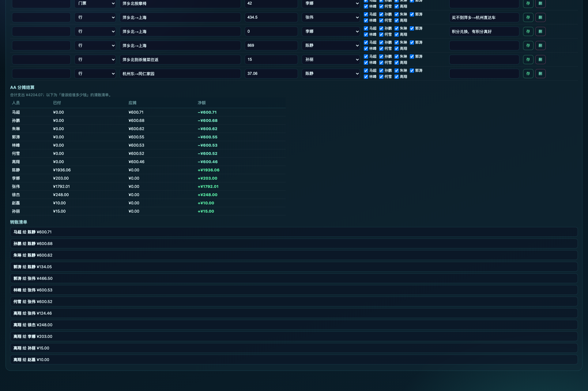

# travel-screen · 旅行足迹大屏

一个用 Spring Boot + ECharts 做的**个人旅行足迹可视化大屏**：中国地图 3D 飞线、消费结构、年度足迹、花费排行、同行伙伴、照片墙、AI 行程规划。单文件前端、零外链、纯本地渲染（中国边界数据来自阿里云 DataV GeoAtlas，合规含台湾省与十段线）。

> ⚠️ 仓库内的示例种子数据（`src/main/resources/data/seed-trips.json`）**均为脱敏后的虚构同行人姓名**，城市/路线/金额为演示用途，不含任何真实个人身份信息。请勿将生产数据库（`traveldb.mv.db`）或 `.env` 提交到公开仓库。

## 效果预览

以下截图均为本地 H2 + 脱敏示例数据（虚构同行人姓名）渲染，页面不含任何真实个人身份信息。

### 数据大屏（2D / 3D）


### 数据维护（Excel 式后台）

- **数据维护主页**：左侧按「活动 / 大行程 → 子行程 → 明细」树形展开，右侧行内直接编辑，支持导入 / 导出 xlsx。

  

- **新建活动**：三步向导（基本信息 → 参与者与角色 → 记第一笔），归属团队可选。

  

- **账单 AA 分摊**：按行程明细自动算出「谁该给谁多少钱」的清账清单，含已付 / 应摊 / 净额与转账建议。

  

### AI 行程规划

- 输入目的地、天数、人数、预算与偏好，一键生成行程方案（需配置 `AI_API_KEY`）。

  

## 技术栈

- 后端：Spring Boot 3.3.5 + Java 21 + JPA/Hibernate
- 前端：单文件 HTML（`src/main/resources/static/index.html`），原生 JS + ECharts 5.5.1 + echarts-gl 2.0.9
- 存储：本地 H2 文件库（默认）；生产可切 MySQL（prod profile）
- 构建：Maven

## 快速开始（本地）

```bash
# 1. 构建
mvn -DskipTests package

# 2. 运行（默认 local profile，使用 H2 文件库，零配置）
java -jar target/travel-screen.jar

# 3. 打开大屏
#    http://localhost:8388/
# 演示账号（仅能操作「示例·演示」团队，不影响真实数据）：
#    demo@travel.cn  /  任意密码
# 管理员登录：/login  （默认 admin / admin123，首次启动后请改密码）
```

AI 行程规划默认未配置 Key；设置环境变量 `AI_API_KEY`（智谱 GLM）后启用：

```bash
AI_API_KEY=sk-xxx java -jar target/travel-screen.jar
```

## 配置（环境变量，均可在 application.yml 查看默认值）

| 变量 | 说明 |
|------|------|
| `SPRING_PROFILES_ACTIVE` | `local`=H2 文件库（默认）；`prod`=MySQL |
| `DB_URL` / `DB_USER` / `DB_PASS` | prod 模式 MySQL 连接信息 |
| `ADMIN_USER` / `ADMIN_PASS` | 默认管理员账号/密码（**请务必修改**） |
| `AI_API_KEY` / `AI_MODEL` / `AI_VISION_MODEL` | 智谱 GLM 文本/视觉模型 Key 与模型 ID |
| `PHOTO_DIR` | 照片存储目录（默认 `./photos`） |

## 部署

见 [DEPLOY.md](DEPLOY.md)（systemd / nohup 两种方式，部署前请替换其中的占位符并修改默认密码）。

## 目录结构

```
src/main/resources/
  application.yml          # 配置（凭据全部走环境变量）
  data/seed-trips.json     # 脱敏示例种子数据
  static/index.html        # 单文件大屏前端
  static/vendor/           # echarts / echarts-gl / 地图 GeoJSON（本地化）
deploy/                    # systemd 单元、启动脚本、备份脚本（凭据均为占位符）
```

## License

[MIT](LICENSE)
