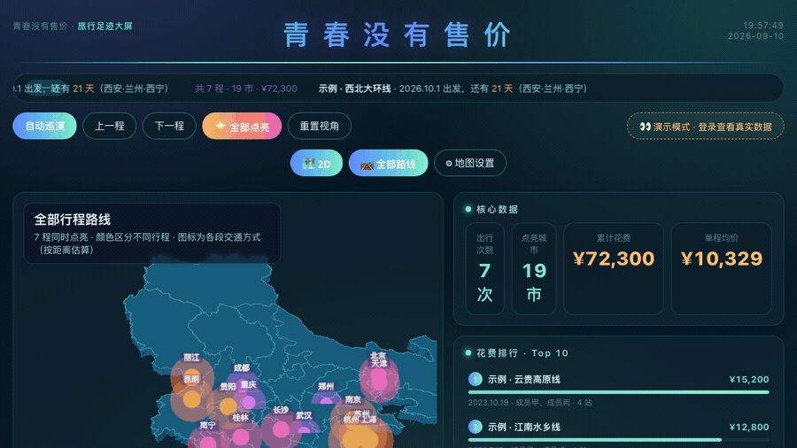

# travel-screen · 旅行足迹大屏

[English](README_EN.md) | 中文

     

一个用 Spring Boot + ECharts 做的**个人旅行足迹可视化大屏**：中国地图 3D 飞线、消费结构、年度足迹、花费排行、同行伙伴、照片墙、AI 行程规划。单文件前端、零外链、纯本地渲染（中国边界数据来自阿里云 DataV GeoAtlas，合规含台湾省与十段线）。

> ⚠️ 仓库内的示例种子数据（`src/main/resources/data/seed-trips.json`）**均为脱敏后的虚构同行人姓名**，城市/路线/金额为演示用途，不含任何真实个人身份信息。请勿将生产数据库（`traveldb.mv.db`）或 `.env` 提交到公开仓库。

## 效果预览

以下截图均为本地 H2 + 脱敏示例数据（虚构同行人姓名）渲染，页面不含任何真实个人身份信息。

### 数据大屏（2D / 3D）

**2D 大屏**：中国地图城市点亮、核心数据与花费排行。


**3D 地图**（`geo3D`：自动旋转 + 城市光柱 + 飞线流光）：




### 数据维护（Excel 式后台）

- **数据维护主页**：左侧按「活动 / 大行程 → 子行程 → 明细」树形展开，右侧行内直接编辑，支持导入 / 导出 xlsx。

  

- **新建活动**：三步向导（基本信息 → 参与者与角色 → 记第一笔），归属团队可选。

  

- **账单 AA 分摊**：按行程明细自动算出「谁该给谁多少钱」的清账清单，含已付 / 应摊 / 净额与转账建议。

  

### AI 行程规划

- 输入目的地、天数、人数、预算与偏好，一键生成行程方案（需配置 `AI_API_KEY`）。

  

## 技术栈

- 后端：Spring Boot 3.3.5 + Java 21 + JPA/Hibernate
- 前端：单文件 HTML（`src/main/resources/static/index.html`），原生 JS + ECharts 5.5.1 + echarts-gl 2.0.9
- 地图：**离线内嵌矢量底图**，覆盖全国 369 个地级市 + 34 个省级行政区 + 南海诸岛十段线。
  无地图瓦片、无 API Key、无任何外链资源；底图由独立端点 `GET /api/geo` 提供并缓存一天，
  与行程数据（`GET /api/screen-data`）解耦
- 存储：本地 H2 文件库（默认）；生产可切 MySQL（prod profile）
- 构建：Maven

## 快速开始（本地）

**最省事的方式**：直接下最新 [Release](https://github.com/Makezx/travel-screen/releases/latest) 里的 jar，不用装 JDK 之外的任何东西、不用编译。

```bash
java -jar travel-screen-v1.0.0.jar
```

想自己编译就用下面的步骤：

```bash
# 1. 构建
mvn -DskipTests package

# 2. 运行（默认 local profile，使用 H2 文件库，零配置）
java -jar target/travel-screen.jar

# 3. 打开大屏
#    http://localhost:8388/
# 演示账号（仅能操作「示例·演示」团队，不影响真实数据）：
#    demo@travel.cn  /  Demo@2026
# 管理员登录：/login  （默认 admin / admin123，首次启动后请改密码）
```

AI 行程规划默认未配置 Key；设置环境变量 `AI_API_KEY`（智谱 GLM）后启用：

```bash
AI_API_KEY=sk-xxx java -jar target/travel-screen.jar
```

## 快速开始（Docker 一键启动）

不想在本机装 JDK 21 + Maven？装了 Docker 的话，一条命令就能跑起来：

```bash
# 1. 构建并后台启动（首次会下载依赖并编译，约 3～8 分钟；之后启动是秒级）
docker compose up -d

# 2. 打开大屏
#    http://localhost:8388/
# 演示账号（仅能操作「示例·演示」团队，不影响真实数据）：
#    demo@travel.cn  /  Demo@2026
# 管理员登录：/login  （默认 admin / admin123，首次启动后请改密码）

# 3. 查看日志 / 停止
docker compose logs -f travel-screen
docker compose down          # 停止并移除容器，数据卷保留
```

说明：

- **数据持久化**：H2 数据库文件、账号文件、密钥文件存放在具名卷 `travel-screen-data`（容器内 `/app/data`）；上传的照片存放在具名卷 `travel-screen-photos`（容器内 `/app/photos`）。容器重建、升级镜像数据都不会丢。
  - 查看卷：compose 会给卷名加上项目前缀（默认取目录名，例如在 `travel-java` 目录下就是 `travel-java_travel-screen-data`），用 `docker volume ls | grep travel` 查看实际名称，再 `docker volume inspect <名称>`
  - **彻底清空数据**（不可恢复）：`docker compose down -v`
- **改管理员密码**：在 `docker-compose.yml` 同级新建 `.env`，写入 `ADMIN_USER=你的账号` 与 `ADMIN_PASS=你的强密码`，然后 `docker compose up -d` 重建容器生效。
- **启用 AI 行程规划**：在 `.env` 里追加 `AI_API_KEY=sk-xxx` 后重建容器。
- **改用 MySQL**：把 `docker-compose.yml` 里的 `SPRING_PROFILES_ACTIVE` 改成 `prod`，并补充 `DB_URL` / `DB_USER` / `DB_PASS`。
- **调 JVM 参数**：在 `.env` 里设置 `JAVA_OPTS=-Xmx512m` 等。
- 只用 Docker 不用 compose 也可以：
  ```bash
  docker build -t travel-screen:latest .
  docker run -d -p 8388:8388 -v travel-screen-data:/app/data -v travel-screen-photos:/app/photos --name travel-screen travel-screen:latest
  ```

### 发布自己的镜像到 Docker Hub（可选）

仓库自带 `.github/workflows/docker.yml`：**发布 Release 时会自动构建 `linux/amd64` + `linux/arm64` 双架构镜像并推送到 Docker Hub**。

用之前需要在仓库里配两个密钥（**Settings → Secrets and variables → Actions → New repository secret**）：

| 密钥名 | 值 |
|---|---|
| `DOCKERHUB_USERNAME` | Docker Hub 用户名（**不是邮箱**） |
| `DOCKERHUB_TOKEN` | Docker Hub 个人访问令牌，权限选 **Read & Write** |

令牌获取：登录 [Docker Hub](https://hub.docker.com) → 右上角头像 → **Account settings** → **Personal access tokens** → **Generate new token** → 填描述与有效期、权限勾 `Read & Write` → **Generate**。⚠️ 令牌只在生成时显示一次，关掉就再也看不到，请立即保存。

> **不要把令牌贴进代码、Issue 或聊天里。** 配到仓库 Secrets 中，流水线会通过 `secrets.*` 读取，不会出现在日志里。

没配密钥时该工作流会自动跳过（不会报错）。首次推送会自动创建 `travel-screen` 仓库，若提示无权限则先在 Docker Hub 手动建一个同名仓库。

配好后，任何人可以直接：

```bash
docker run -d -p 8388:8388 \
  -v travel-screen-data:/app/data -v travel-screen-photos:/app/photos \
  --name travel-screen <你的用户名>/travel-screen:latest
```


## 配置（环境变量，均可在 application.yml 查看默认值）

| 变量 | 说明 |
|------|------|
| `SPRING_PROFILES_ACTIVE` | `local`=H2 文件库（默认）；`prod`=MySQL |
| `DB_URL` / `DB_USER` / `DB_PASS` | prod 模式 MySQL 连接信息 |
| `ADMIN_USER` / `ADMIN_PASS` | 默认管理员账号/密码（**请务必修改**） |
| `AI_API_KEY` / `AI_MODEL` / `AI_VISION_MODEL` | 智谱 GLM 文本/视觉模型 Key 与模型 ID |
| `PHOTO_DIR` | 照片存储目录（默认 `./photos`） |

## 部署

见 [DEPLOY.md](DEPLOY.md)（systemd / nohup 两种方式，部署前请替换其中的占位符并修改默认密码）。

## 目录结构

```
src/main/resources/
  application.yml          # 配置（凭据全部走环境变量）
  data/seed-trips.json     # 脱敏示例种子数据
  static/index.html        # 单文件大屏前端
  static/vendor/           # echarts / echarts-gl / 地图 GeoJSON（本地化）
deploy/                    # systemd 单元、启动脚本、备份脚本（凭据均为占位符）
```

## 参与贡献

欢迎 Issue 和 PR。开工前建议先看 [CONTRIBUTING.md](CONTRIBUTING.md)，里面写了本地跑法、必须遵守的几条约定（保留字列名、前端零外链、地图合规），以及这个项目**刻意不做**的事。

| 我想…… | 去哪 |
|---|---|
| 提问、聊想法、晒自己的大屏 | [Discussions](https://github.com/Makezx/travel-screen/discussions) |
| 报 Bug | [Bug 报告](https://github.com/Makezx/travel-screen/issues/new?template=bug_report.yml) |
| 提新功能 | [功能请求](https://github.com/Makezx/travel-screen/issues/new?template=feature_request.yml) |
| 报安全漏洞 | [私密漏洞报告](https://github.com/Makezx/travel-screen/security/advisories/new)（**别开公开 Issue**） |

- 变更记录：[CHANGELOG.md](CHANGELOG.md)
- 安全与部署硬性要求：[SECURITY.md](SECURITY.md)
- 行为准则：[CODE_OF_CONDUCT.md](CODE_OF_CONDUCT.md)

## License

[MIT](LICENSE)
